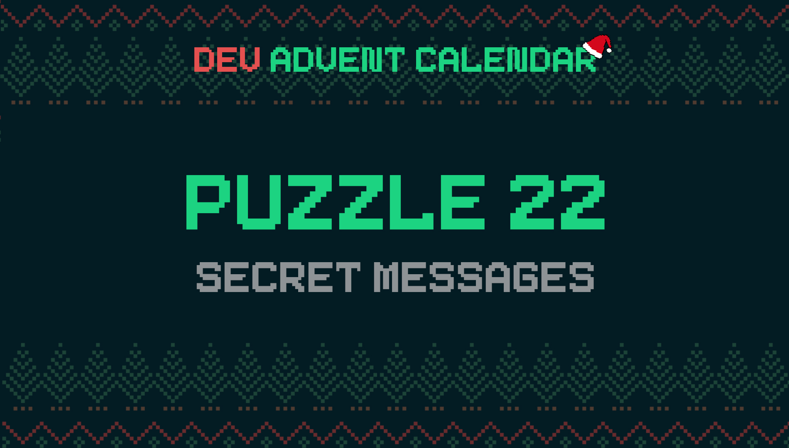

ℹ️ For detailed information about the contest, check out [devadvent/readme](https://github.com/devadvent/readme/)

# Dev Advent Calendar 🎅 Puzzle 22 - Secret Messages ✉️

Some kid elves are making trouble in school, by sending themselves encrypted messages during class and disturbing the class with it.

Write an algorithm that deciphers the messages

## 🧩 The puzzle

Complete the function `caesar` in the file [src/utils/caesar.js](src/utils/caesar.js)!
Write a function that is able to cipher AND decipher messages with the [Caesar Cipher](https://en.wikipedia.org/wiki/Caesar_cipher).

What it basically does is, shift the letters by `shift` places in the alphabet.
For example:

-   `ABC` with a shift of 1 would be `BCD`
-   `XYZ` with a shift of 1 would be `YZA`

When the `shift` parameter is negative, it means that a message should be decoded instead of encoded.

The function takes two arguments:

-   `text`: Text that needs to be ciphered (or deciphered)
-   `shift`: The amount of letters the alphabet is "shifted"

The return value should be the converted text.

If the value is not a letter from the latin alphabet (a-z, or A-Z), return the original value.

ℹ️ You can try out the caesar cipher here:
[https://www.dcode.fr/caesar-cipher](https://www.dcode.fr/caesar-cipher)

## 🚢 Ship your solution

Check out the [contributing guide](https://github.com/devadvent/readme/blob/main/CONTRIBUTING.md) for details about how to participate.

In short:

-   ✨ Create your repository by [acceping the assignment](https://classroom.github.com/a/65rETgG2) using the participation link
-   🧩 Solve the puzzle
-   🐦 Add your Twitter handle to `twitter.js`
-   🤖 Test your solution
-   🚀 Upload your changes to the `main` branch

## 🔗 Participation link

In order to participate, you need to enter the following link and accept the assignment:
[https://classroom.github.com/a/65rETgG2](https://classroom.github.com/a/65rETgG2)

## 💻 Use this project

### ⏳ Install the dependencies

Install the dependencies with

```bash
yarn install
```

or

```bash
npm install
```

### ⚙️ Run the code

Run the code with

```bash
yarn dev
```

or

```bash
npm run dev
```

### 🤖 Test your solution

This puzzle is equipped with automated tests (in the `./tests` folder). In order for your solution to qualify for winning the daily prize, **all** tests need to pass.

To run these tests, execute one of the following commands in your console:

```bash
yarn test
```

or

```bash
npm test
```
